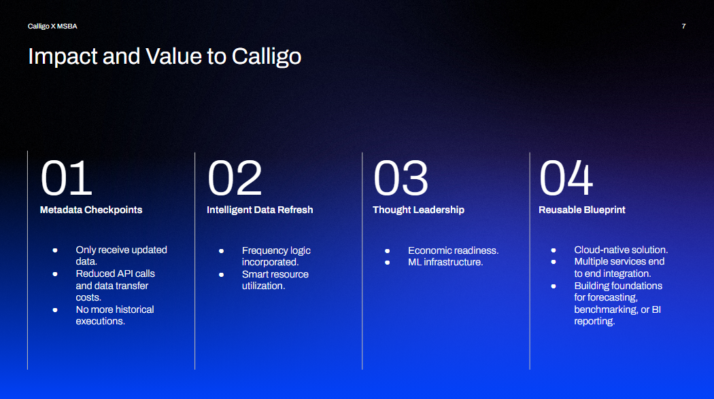

# Calligo
# 📊 Calligo: A UW Capstone project

Calligo is a full-stack data pipeline that pulls macroeconomic time series from the [FRED API](https://fred.stlouisfed.org/), stores them in a s3 database as csv files, and analyzes them using forecasting models (VAR, Monte Carlo, XGBoost). The project is containerized with Docker and includes a Dash web app for interactive exploration.

---

## 🚀 Features

- 🔄 Automated data ingestion from FRED
- 📈 Forecasting models (VAR, Monte Carlo simulation, XGBoost classifier)
- 📊 Dash web app for visualizations
- ☁️ AWS-ready (S3, Glue-compatible)
- 🐳 Fully containerized with Docker

---

## 🛠️ Technologies

- Python, Dash, Plotly
- PostgreSQL (optional integration)
- Docker
- Pandas, Scikit-learn, statsmodels
- AWS S3 

## 📦 Setup (Docker)

```bash
# Build and start the services
docker build -t dash .
docker run -p 8050:8050 dash
```


## 🗺️ Solution Overview

## 🎥 Live Demo
[](https://youtu.be/QnYO6jEtZjE)
[](https://youtu.be/Mv3E31pOVcQ)



---

## 🚧 Known issues
### Incremental loading 
Our incremental loading needs to be ran relatively often once all the data is loaded otherwise the data won't be included in the refresh.
Another issue we have not tackled due to the limiting rates of the fred API is a check if any of the data has been change in the past: this will not be captured and could cause issues with some of our predictive models.

### Dash App
The Dash app struggled to incorporate some of the python files which included the models. To go past this obstacle, we made the decision to run some of the models individually and save the results in the data and assets folders. This means that unless they are not ran by the user, the Dash app will not have the updated data or model from the S3 instance from which the models are pulling the data.

### Models
The currency exchange rate predictive model does not work the same in the Dash and originial file, our goal was mainly to predict whether it would go up or down so the version in Dash is sufficient for that. 
The VAR model is not a consistent model: it is currently more of a test jupyer notebook as proof that a long loading of the data can still eventually make it to the dash app.

---

## 🧑‍💻 Authors
[Chirayu Betkekar](https://www.linkedin.com/in/chirayu-betkekar/)
[David (Sin Myung) Han](https://www.linkedin.com/in/sinmyunghan/)
[Beckten Harkleroad](https://www.linkedin.com/in/beckten-harkleroad/)
[Rohan Soni](https://www.linkedin.com/in/rohansoni98/)
[Florent Lee](https://www.linkedin.com/in/florent-lee/)
