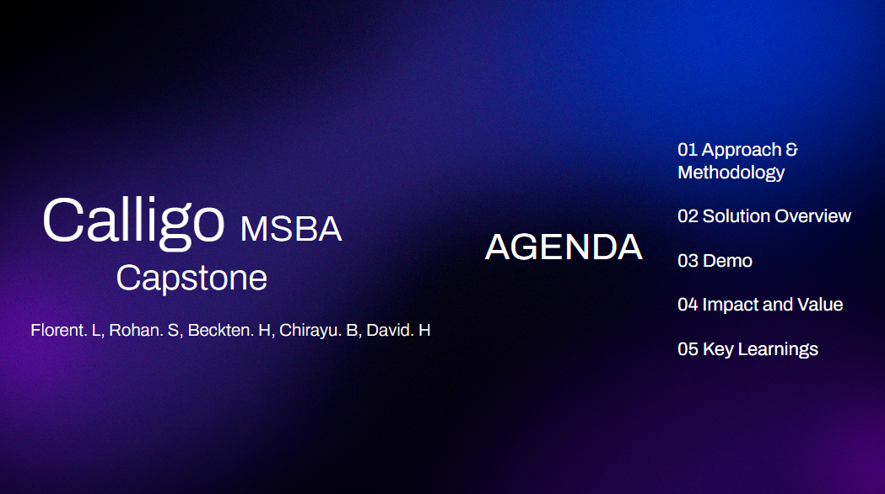

# Calligo
# 📊 Calligo: A UW Capstone project

Calligo is a full-stack data pipeline that pulls macroeconomic time series from the [FRED API](https://fred.stlouisfed.org/), stores them in a s3 database as csv files, and analyzes them using forecasting models (VAR, Monte Carlo, XGBoost). The project is containerized with Docker and includes a Dash web app for interactive exploration.

---

## 🚀 Features

- 🔄 Automated data ingestion from FRED
- 📈 Forecasting models (VAR, Monte Carlo simulation, XGBoost classifier)
- 📊 Dash web app for visualizations
- ☁️ AWS-ready (S3, Glue-compatible)
- 🐳 Fully containerized with Docker

---

## 🛠️ Technologies

- Python, Dash, Plotly
- PostgreSQL (optional integration)
- Docker
- Pandas, Scikit-learn, statsmodels
- AWS S3 

## 📦 Setup (Docker)

```bash
# Build and start the services
docker build -t dash .
docker run -p 8050:8050 dash
```




## Solution Overview

## Live Demo
[](https://youtu.be/QnYO6jEtZjE)
[](https://youtu.be/Mv3E31pOVcQ)


